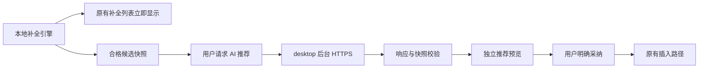

# Fastab 接入 Jev：可行性与实施计划

日期：2026-09-22。研究对象：本轮内存优化完成后的 Fastab 工作区。用户已明确选择 **Fastab 补全功能**，不是编码 Agent 的开发工具。

## 结论与推荐范围

**技术上可行，建议实施默认关闭的“AI 候选推荐”实验功能。** 本地引擎继续生成、筛选和显示补全；用户主动请求后，Jev 在一个有限、可追溯的候选集合中选择，结果以独立预览呈现，用户再明确采纳。首版不自动改动已经显示的补全顺序，不把网络请求放进本地补全关键路径。

设置页纳入 **API Key 填写/替换/删除、TypeSafe 与 OpenRouter 服务商选择、预置 Base URL 和模型，以及高级自定义 System One 地址**。OpenRouter 已有官方 Jev 兼容接口，不需要改用聊天模型；选择预设时无需手工填写地址。自定义地址必须实现相同协议，不能承诺任意 OpenAI-compatible 服务都可用。

技术可行不等于收益已证明：对于 `git ch` 这类已有精确匹配、历史接受记录的输入，本地排序可能已经足够好。若不发送私人上下文，Jev 可获得的信息更少；是否值得增加网络成本和交互步骤，需要以后用明确授权的样例评估。本次未做真实 API 调用、性能或质量验证，不建议直接默认开启。

本次只新增本文档。没有安装 SDK/插件、接入产品代码、操作 Keychain、读取密钥、上传终端数据或触发任何本地/远程测试、构建、lint、格式检查、采样、CI。此前工作区改动保留。

## 1. 推文与官方能力的适配

已读取用户给出的[推文](https://x.com/3three_AI/status/2102252548921114776)。它是十个 Jev 项目的汇总，提供应用方向，不是 Fastab 的接入规范；星数和演示速度不作为本项目收益证据。

| 方向 | 与 Fastab 的关系 | 本计划取舍 |
| --- | --- | --- |
| 对有限选项做选择/评分 | 可以映射到现有补全候选 | 首版用 Choice 产生推荐；保留原始候选和本地顺序 |
| 自由生成新命令、参数值或解释 | Jev 不提供自由文本生成 | 不承诺自然语言生成整条命令，不替换 spec/generator |
| 浏览器、桌面自动操作 | 推文中的应用把模型决策映射成操作 | 不引入自动点击、自动执行 shell 或新系统权限 |
| Agent 上下文压缩、代码审查 | 属于开发工作流 | 不纳入产品依赖，也不视为 Fastab 内存优化 |

[fast-jev-compaction](https://github.com/tamaratran/fast-jev-compaction#readme) 面向 Claude Code 会话压缩，[jev-review](https://github.com/devagrawal09/jev-review#readme) 面向代码审查，[TypeSafe skills](https://github.com/typesafe-ai/skills#readme) 是开发指导。产品可直接调用 HTTP，无需把这些项目或 Node/Python sidecar 装入 `.app`。

官方公开契约与本计划选择：

- `POST https://api.typesafe.ai/v1/systemone`，Bearer 鉴权，JSON 包含 `state`、`model`、`questions`，响应有 `answers` 和 `usage`。Rust 可直接调用；desktop 当前没有直接声明 reqwest，workspace 已有相应依赖配置。[HTTP API](https://docs.typesafe.ai/api)
- Choice 返回选项、各选项概率及 confidence，最多 255 个选项；首版远小于此限制，并增加 `keep_local` 作为“不改变”的选项。问题 ID 不参与模型推理，候选含义必须明确写在 instructions/criteria 中。[Choice](https://docs.typesafe.ai/primitives/choice)
- Score 是 2–10 级量表上的分数，可为小数，不天然是 0–1；Noul 是 yes 的概率，没有独立 confidence。首版不同时叠加多套评分规则，避免未经校准的权重和阈值。[Score](https://docs.typesafe.ai/primitives/score)、[Noul](https://docs.typesafe.ai/primitives/noul)
- confidence 描述概率分布的集中程度，不是准确率保证；类型受约束也不代表判断不会错。任何结果都不能扩大候选集合或授权命令执行。[Confidence](https://docs.typesafe.ai/confidence)
- 当前文档列出 `jev-1.13.0`，应固定经评估的版本；不依赖会移动的 `jev-latest`/`jev-preview`。公开 token/速率上限可能调整，不能代替客户端自己的字节、并发和请求预算。[Models](https://docs.typesafe.ai/models)
- OpenRouter 官方提供 System One 兼容入口，使用 OpenRouter Key；本计划增加第二个服务商预设，沿用受限候选协议，按服务商处理模型 ID、响应扩展及错误。具体地址和版本见第 6 节。[OpenRouter TypeSafe 接入说明](https://openrouter.ai/docs/guides/community/typesafe-sdk)

## 2. 当前源码支持与接入位置

| 现有入口 | 已核对事实 | 设计影响 |
| --- | --- | --- |
| [runtime.rs](../crates/fastab_engine/src/runtime.rs)、[rank.rs](../crates/fastab_engine/src/rank.rs) | 本地合并历史，执行匹配、优先级及接受记录排序；Suggestion 有插入元数据和危险标志 | 保留原算法；不能让模型改 `insert_value`、转义、空格、删除范围或执行标志 |
| [worker.rs](../crates/fastab_engine/src/worker.rs) | worker 执行同步补全并合并等待中的请求 | 不在 worker 或 rank 中等待 HTTP |
| [desktop/overlay.rs](../crates/fastab_desktop/src/overlay.rs) 的 `apply_completion` | 已检查 generation/session；最终结果随后转为 UI 行 | 在有效最终结果处建立候选快照；`pending_generators` 的中间结果首版跳过 |
| [GPUI overlay.rs](../crates/fastab_gpui/src/overlay.rs) 的 `set_suggestions_with_match_term` | 只有用户已改变选中项时才按身份保持选择，否则刷新会选第 0 项 | generation 正确也可能发生“晚到排序换掉即将 Tab 的首项”；不能自动重排已显示列表 |
| [list.rs](../crates/fastab_gpui/src/list.rs)、desktop `insert_item` | 显示身份与真实插入内容并不相同；现有路径负责插入和接受记录 | 使用本地不可变候选 ID 映射，不按名称查找或让模型返回插入字符串 |
| [settings_ui.rs](../crates/fastab_desktop/src/settings_ui.rs)、[gpui_host.rs](../crates/fastab_desktop/src/gpui_host.rs) | 有原生设置页、事件刷新路径；`ReloadCredentials` 名称不代表已有 Jev 密钥系统 | 增加专用 AI 配置及失效事件，不用设置刷新伪造接受或执行 |
| [settings/lib.rs](../crates/fastab_settings/src/lib.rs) | 设置写普通 JSON | 只存开关、模式、版本等非秘密配置，不存 API key |

失败、取消、过期或没有合格候选时，仅结束 AI 流程，原列表继续使用。关闭 AI 时不得创建请求、候选缓存或常驻额外 worker。

## 3. 首版行为契约

1. 设置默认关闭；选择服务商、配置该服务商自己的 API Key 并确认数据范围后，出现“AI 推荐”入口。首版仅鼠标显式触发，不占用已有 Tab/Enter/Escape 快捷键，也不抢终端焦点。保存配置不隐式调用云端，不自动用真实终端内容测试连接。
2. 原列表始终由本地引擎控制。AI 的概率排序只用于独立预览，首版最多显示 3 个已有候选；`keep_local` 胜出时提示“保留当前排序”，不改变列表。
3. 采纳使用独立按钮，重新核对当前上下文，再调用现有插入逻辑且 `execute=false`。不发回车、不自动执行；拒绝含换行、控制字符、`is_dangerous`、`auto-execute`、`special` 或无法确认插入语义的候选。引擎危险标志必须在转成 UI 行之前检查，不能依赖当前 UI DTO 携带它。
4. 用户继续输入、改变光标/选择、普通补全被接受、隐藏、切换会话/终端、cwd/环境或候选修订变化时，取消并移除旧推荐。对已触发的插入不做撤销或重放。
5. 不修改 alphabetical 设置、精确匹配优先、历史接受记录、共同前缀 Tab、onlyShowOnTab、粘贴/历史唤起隐藏规则、原 `···` loading owner 和脚本超时。
6. AI 预览只显示原候选的公开说明，不生成解释；不能仅因为 AI 曾推荐就写入接受记录，仍以现有插入成功路径为准。

## 4. 候选身份、来源与外发数据

这是实施前必须闭合的前置条件。当前 `Suggestion.kind` 不能可靠地区分公共 bundled spec、历史、文件、动态 generator 或自定义 spec；字段名看起来像 command/option，不代表内容可外发。

### 4.1 首版允许范围

- 只允许来自已确认公共 bundled 规格的静态命令、子命令和选项，保持本地筛选后的候选集合。来源信息必须从 registry/规格加载、静态候选生成一路传播，不能在 UI 根据 kind 或文件路径猜测。
- `EC_SPECS_DIR` 覆盖、自定义/版本化来源、generateSpec/loadSpec 动态结果、hooks、history、路径/文件名、分支名/容器名等动态资源，以及来源混合或未知的候选，默认不入 AI 快照。合并去重时采用保守来源策略，不能因和静态候选同名就被标成公共。
- “来自 bundled”本身也不足以证明公开：构建来源需对应已知公开包及固定版本/内容标识。不能证明时标 Unknown 并跳过；不得为了扩大覆盖率默默放宽。
- `is_dangerous`/隐藏项/执行项等硬过滤先于 AI；模型不能把被过滤项加回来。首版候选不足 2 项则不请求。

### 4.2 专用外发 DTO

只构造一个独立 DTO，最多包括：规范化 shell 类型、来自公共规格的命令/子命令路径、可匹配到公共候选的当前 token 前缀、候选临时 ID、公共名称和截短的公共说明。每个字段都经过来源白名单；无法解析或含未知自由参数的输入首版跳过，不能用正则“已脱敏”代替来源证明。

不得序列化 `CompleteRequest`、`CompleteResult` 或 `ClickInsert` 整体。以下均不外发：原始完整 buffer、cwd/主机/会话标识、环境变量、aliases、终端历史、接受历史、文件内容、动态名称、API key 以外的秘密，以及真实插入字符串。API key 只进入指定服务的 Authorization header。

候选本地 ID 是当前快照的不可复用编号，例如 `c0`，映射保留完整插入元数据。重复显示名称不能合并身份；快照外的 ID 一律拒绝。来源判断与 UI 快照保留数据都受容量限制，避免复制整个 spec/历史或图标解码对象。

### 4.3 数据条款

TypeSafe 隐私条款说明不使用 Input 训练/微调，但数据在美国处理，保留时间不是固定零天；企业 ZDR 需另外联系。MCA §4.1/4.3 还约定服务、计费、遥测、反滥用及法定义务相关处理，没有统一保留 TTL；“不训练”不等于“不存储”。[Privacy Policy](https://typesafe.ai/legal/privacy-policy)、[Legal](https://docs.typesafe.ai/legal)、[MCA](https://typesafe.ai/legal/mca)

选择 OpenRouter 时，数据先经过 OpenRouter 再到模型服务商，必须同时说明这条路径，不能只展示 TypeSafe 条款。OpenRouter 的输入/输出日志和产品改进选项默认关闭，但用户账户设置可改变，且仍收集请求元数据；不由客户端宣称整条链路 ZDR。[OpenRouter 数据处理说明](https://openrouter.ai/docs/guides/privacy/data-collection)。自定义地址的运营方、保留和转发政策由用户自行选择的服务决定，设置页显示实际接收地址，不套用两家官方服务的承诺。本次没有传输任何终端/项目数据。

## 5. API、异步与资源设计

### 5.1 请求与校验

用 desktop 私有 `jev` 模块和 workspace reqwest 配置实现 System One client，按已保存的服务商配置生成请求；不使用遥测 client。只允许 HTTPS，保留证书校验，拒绝所有 HTTP 重定向，Authorization 标为 sensitive。密钥绑定服务商及规范化后的实际 endpoint，修改地址不沿用旧密钥；日志不打印 header、原始请求/响应或可能回显输入的错误正文。预设与高级地址规则见第 6 节。

首版一个 Choice 问题，含最多 20 个合格候选及 `keep_local`。instructions 明确要求根据已给出的有限上下文选择；上下文不足时选 `keep_local`。参数和候选文本是数据，不具备修改应用权限或操作流程的权力。

校验 response 的 HTTP 状态、JSON 类型、服务商对应的已审查模型映射、预期 question ID、所有候选 ID、choice 与概率映射一致性、概率有限且位于 0–1、总和在明确浮点容差内、confidence 范围，以及响应对应的原快照。缺失/重复 JSON key、额外候选、结构变化、超限和非有限数值视为失败，不做“猜一个最像的名字”修复。只处理 Choice，避免为未使用的 Score/Noul 引入宽松通用解析器。浮点容差与缺失/无效等待提示时的冷却参数须在 P2 冻结。

OpenRouter 响应可增加 `id`、`provider`、`usage.cost`；允许这些已知 envelope 扩展，不因此放松 `answers` 校验。其返回模型可以是服务端实际快照 ID，不能与 TypeSafe 的 `jev-1.13.0` 作字面相等校验，也不能仅按字符串前缀放行任意未来版本。P0/P2 固定每个预设的请求 ID 与允许响应 ID 映射；自定义服务须明确其模型契约，未审查映射保持不可请求，不自动猜测或切换模型。

### 5.2 任务与失效

- 所有 HTTP 在现有 Tokio runtime 执行，保留可取消句柄，通过新增 Event 回到 GPUI。GPUI foreground 不直接 await reqwest、Tokio channel 或计时器。
- 请求令牌包含本地 `session_id + generation + candidates_revision + request_id + settings_epoch + profile_id`；profile 绑定服务商、endpoint、模型及凭据版本。另保存包含插入相关输入/光标/cwd/环境版本的本地上下文指纹，仅本地使用。
- 发起、返回、显示预览、采纳四个位置都核对令牌和当前快照。来源、候选顺序/身份/插入元数据改变即更新 revision，不能只比较名称或现有 selection_identity。
- 输入/导航/隐藏/会话/设置/密钥变化立即使令牌失效并取消任务；即使取消后仍收到完成事件也丢弃。取消客户端请求不等于撤销服务端已产生的计费。
- 网络 loading 单独标在 AI 入口/预览，不能占用本地补全 loading latch，也不重复统计本地补全展示或触发生成器。

### 5.3 首版资源参数（建议值，未实测）

| 项目 | 首版建议 | 目的 |
| --- | --- | --- |
| 自动触发 | 无；每次由用户主动触发 | 不在每个按键发请求 |
| 在途/排队 | desktop 全局最多 1 个请求，0 个排队项 | 替代时先取消并结束旧任务再启动；防多终端堆积 |
| 候选 | 最多 20 个 + `keep_local`；说明按 UTF-8 边界截短到 256 字节 | 限制快照和传输大小 |
| 请求/响应 | 完整请求最多 16 KiB；解码后响应最多 64 KiB | 读响应时增量限额，不能完整读入后才截断 |
| 总 deadline | 2 秒，覆盖一次请求的连接、发送和读取 | 显式功能超时退出；本地列表从不等待 |
| 频率 | 最多 20 次/分钟，按整个 desktop 计算 | 与供应商动态额度分离；超限不入队 |
| 结果缓存 | 首版无跨请求/持久缓存，只保留当前有效快照与预览 | 关闭、失效和采纳后释放 |
| 重试 | 单次请求不自动重试 | 避免按键/会话变化后继续消费旧工作 |

401 停止当前配置的请求并提示凭据不可用；422 记录脱敏的契约错误并保留本地结果；429/529 按服务端等待提示进入后续请求冷却，没有提示时采用有上限的本地冷却；其他网络/服务错误本次失败。冷却结束不自动补发，只允许下次主动请求。TypeSafe 官方列出这些错误类型；OpenRouter 的鉴权/余额/限流等错误在适配层单独归一化，未知错误也只保留本地结果，不把所有失败都报成 Key 错误。具体冷却下限/上限与 `Retry-After` 解析规则在 P2 冻结，整体 deadline 和资源预算始终是应用策略。[HTTP API](https://docs.typesafe.ai/api)

这不是内存优化：新增 HTTPS、凭据和快照可能增加 desktop 内存。约束新增驻留资源，同时不向每个 `fastabterm` 或 IME 加入模型/HTTP 依赖，不抵消已完成的 PTY 有界队列改动。

## 6. 设置与密钥

### 6.1 用户配置入口

在原生设置的 Behavior/行为页增加“AI 候选推荐”区块，未启用时仍可配置；包括以下控件，提供中文/英文文案：

| 控件 | 行为 |
| --- | --- |
| 启用开关 | 默认关闭；配置有效、凭据可用且数据范围已确认才可启用；关闭即时取消请求、清预览，无需重开终端 |
| 服务商 | TypeSafe、OpenRouter、自定义 System One；预设切换自动展示对应地址和模型，不把上一家的 Key 复制过去 |
| API Key | 遮蔽输入，支持粘贴、保存/替换、删除；显示“未配置/保存中/已配置/当前不可用”，不回显已存密钥；保存成功不等于鉴权验证通过 |
| Base URL | 官方预设自动填入；高级设置允许自定义，修改预设地址后转为独立自定义配置；显示最终请求 URL，避免路径拼错 |
| 模型 | 按服务商预设固定版本；自定义配置填写模型 ID，但启用受已审查协议/响应映射约束，不提供任意聊天模型选择器 |
| 数据说明与配置状态 | 显示实际接收方、外发范围及条款链接；不显示原始 buffer、密钥或服务端回显；保存/删除错误留在当前配置区 |

只填 Key 的正常流程：选择 TypeSafe 或 OpenRouter → 填该平台 Key → 保存 → 阅读范围并启用。地址编辑放在高级区，普通 OpenRouter 用户不必手填。首版不增加自动连接检测；若以后提供“检查连接”，必须由用户主动点击、只发固定公开样例并说明可能计费，不读取当前终端。

现有 `settings_ui.rs` 以按钮、开关和选择菜单为主，没有可直接复用的文本/密码输入组件。P3 需基于 GPUI `EntityInputHandler` 增加单行输入，处理光标、选区、粘贴、UTF-16 范围和设置页 Tab 焦点遍历；密码模式还须约束复制/剪切及系统文本查询，不能只在绘制时换成圆点。不得原样照搬会复制明文的普通输入示例，也不声称具备尚未确认的系统 Secure Input。API Key 不预填已存值；保存成功、切换配置、关闭窗口时清空草稿。输入过程只改组件草稿，不逐字符调用会写 JSON 并发 `ReloadCredentials` 的现有 `set_string`。

### 6.2 服务商地址与模型

| 服务商 | Base URL（不含 `/v1/systemone`） | 最终 POST URL | 请求模型 / 凭据 |
| --- | --- | --- | --- |
| TypeSafe | `https://api.typesafe.ai` | `https://api.typesafe.ai/v1/systemone` | `jev-1.13.0` / TypeSafe Key |
| OpenRouter | `https://openrouter.ai/api` | `https://openrouter.ai/api/v1/systemone` | `typesafe/jev-1.13` / OpenRouter Key |
| 自定义 System One | 用户填写 HTTPS 基址，可有路径前缀 | 规范化基址后追加一次 `/v1/systemone` | 用户服务约定的 Jev ID / 此地址专属 Key；兼容性待确认 |

OpenRouter 官方文档确认请求/响应沿用 TypeSafe 格式，但 model 返回实际服务快照，其示例为 `typesafe/jev-1.13-20260917`；是否可把该日期 ID 直接作为请求模型需另行确认，不把响应示例当作可调用 ID 证明。首版不使用 latest/preview，也不使用社区示例的 alpha 路由。这里的 Base URL 不是聊天接口常见的 `/api/v1`，不能拼接 `/chat/completions`。无需调用模型列表：TypeSafe SDK 的列表解析与 OpenRouter 列表格式不兼容。[官方兼容说明](https://openrouter.ai/docs/guides/community/typesafe-sdk)

URL 规则：解析后只接受 HTTPS，拒绝 userinfo、query、fragment、无效主机及不受支持的端口/路径形式；不允许 Key 放 URL。保留合法路径前缀，规范化尾部斜杠及默认端口，再追加固定 endpoint；若用户填入完整 `/v1/systemone` 或常见误填 `/api/v1`，提示正确基址，不静默重复拼接或猜路由。具体路径编码规则在 P2 固定，显示地址、Keychain 绑定和实际发送必须使用同一规范化结果。自定义服务必须支持 System One，HTTPS 地址正确不代表协议兼容。

### 6.3 配置状态与凭据隔离

建议非秘密设置：`autocomplete.ai.enabled=false`、`autocomplete.ai.mode=manual-preview`、当前 `profile_id`，以及每个 profile 的 `provider/protocol/base_url/model` 和已确认的数据策略版本。首版 protocol 只有 `systemone`，以各预设 adapter 处理响应差异；`mode` 只支持 `manual-preview`。首版每个配置一个 Key，不自动轮换账号。provider、协议、规范化 endpoint、模型、数据策略或凭据变化都增加 `settings_epoch`，取消在途任务并移除预览；编辑草稿与已保存配置分离，草稿期间不发请求。只改模型不强制重新填写同一 endpoint 的 Key。

优先复用已锁定 GPUI 0.2.2 的 `App::write_credentials/read_credentials/delete_credentials`：本机依赖源码已确认 macOS 实现使用 Security/Keychain，调用在 GPUI 后台 executor 执行，无需新增 Node/Python 或另一套密钥库依赖。

必须保留以下实现细节：

- 使用应用专属逻辑服务键，例如 `app.fastab.ai.jev.v1.<provider>.<endpoint_digest>`，digest 来自规范化后的完整 endpoint（包含路径/有效端口，不包含 Key）。GPUI 查询/更新/删除只按传入 server 字符串和类别，不按 username 隔离，不能直接复用公共 API 域名或通过 username 假装隔离账号。TypeSafe、OpenRouter、自定义地址的 Key 分开存取，不自动回退读取另一配置的 Key。
- 凭据操作串行化；保存成功才显示“已配置”。读取的 `Ok(None)` 可能是不存在，也可能是用户取消系统访问，统一显示“当前凭据不可用”，不反复触发系统授权。
- 关闭先取消请求并清内存凭据，但不等于删除所有服务商的 Keychain 项。删除按钮明确作用于当前配置，并等待 Keychain 删除结果；失败时明确报告，不能声称已删除。GPUI 删除“未找到”也可能报错，不能假设接口幂等。
- 持有并 await GPUI 凭据 Task。取消任务不保证中断已经开始的同步 Keychain 调用；用设置 epoch 防止晚到读取重新启用功能，串行处理保存/删除防覆盖。
- 密钥输入使用遮蔽控件，不进入普通设置 JSON、剪贴板自动拷贝、shell 环境、日志或诊断导出；普通 `Vec<u8>` 没有自动清零保证，不声称做到绝对内存擦除。
- 切换/修改地址前使旧配置失效，要求目标配置自己的凭据及数据范围确认；旧地址 Key 不复制、不发送到新地址。保留旧 Key 时仍须提供该配置的删除入口，不产生 UI 无法管理的孤立凭据。普通非秘密配置和 Keychain 不具备跨存储事务：Key 保存/配置保存任一步失败都不启用新配置，并保留可重试、可删除的准确状态。

## 7. 分阶段实施与逐步 Review

每阶段流程：最小改动 → 不同实施者的 GPT-6 Astra 静态 Review → 修正 → 复审 → 更新记录。若仍按本对话约束实施，不运行本地/远程验证；不能因此把发布验收标成通过。以下阶段目前均为**计划，尚未实现**。

| 阶段 | 文件/责任边界 | 产出和必须通过的 Review |
| --- | --- | --- |
| P0：冻结范围 | 本文档、产品交互约定 | 固定显式推荐、零自动执行、公开静态候选范围；冻结 TypeSafe/OpenRouter 预设和自定义 System One 边界、请求/响应模型映射；明确收益未验证、发布不默认开启 |
| P1：来源与快照 | engine `runtime.rs`、`ir.rs`、`generate.rs`、`lookup.rs` 的实际来源路径；必要的构建来源元数据 | 定义并传播来源，未知默认拒绝；专用外发 DTO/不可变 ID/硬过滤/容量上限。Review 合并、alias、override、动态 spec、危险标志及 serialization 兼容；默认关闭时现有输出契约不变 |
| P2：协议客户端 | 新增 desktop `jev/{mod,client,types,policy,config}.rs`（名称可按工程约定调整）、desktop Cargo.toml | System One 共用协议及服务商 adapter；冻结 URL 规范化/拼接、模型映射、浮点容差、冷却参数；截止时间、取消、速率及体积限额。Review 无 worker 阻塞/无界队列、拒绝重定向、凭据绑定地址、正确接受 OpenRouter 扩展、错误归一化、无默认 SDK 重试 |
| P3：设置入口与凭据 | desktop `jev/credentials.rs`、`settings_ui.rs`、原生单行/密码输入组件、`event.rs`、`gpui_host.rs` | API Key 填写/替换/删除、服务商/模型/高级 Base URL、草稿显式保存、GPUI Keychain、配置隔离/epoch、禁用/删除闭环；Review 输入/焦点/密码泄露、非秘密配置和 Keychain 部分失败、晚到操作、接收方说明及旧凭据可管理 |
| P4：推荐预览 | desktop `overlay.rs`、`event.rs`、`gpui_host.rs`；GPUI `overlay.rs`、`list.rs` | 独立入口/预览/采纳事件，原列表不重排；Review 同代晚到结果、重复名称、候选变更、点击令牌、终端焦点、窗口隐藏、失效取消及原插入语义 |
| P5：集成与退出路径 | 上述完整 diff、本文档 | 逐入口走查 session/输入/cwd/服务商/协议/地址/模型/设置/密钥变化，失败回退，取消任务和内存释放；复核 Key 不跨配置发送，没有改 PTY、IME、proto、原排序/历史/图标策略 |
| P6：后续效果与运行验收 | 另行获得验证授权后再确定环境及数据 | 先非敏感固定样例验证协议，再验证真实产品交互、目标网络和效果；当前约束下不执行，结果保持“未验证” |

P1 无法证明数据来源时，不进入真实 API 接入；P2 某服务商协议或模型映射未闭合时，该配置不开放请求；P3 无法证明密钥输入与目标地址隔离时，停止启用该配置。P4 无法证明普通补全行为保持、预览点击绑定当前完整候选身份及上下文时，禁止启用 AI 预览采纳，停止进入 P5，修正并复审后继续；不能以“模型置信度高”放行。自动排序不在本轮范围。P6 未完成前，最多作为默认关闭的实验实现，不宣布生产收益或改成默认启用。

## 8. 后续验收清单与退出条件

以下是将来验证的内容，不是本轮已执行结果，不新增凑数的测试文件。

- **契约与数据：** ID/概率缺失和越界、重复 key、模型变化、超大 body、UTF-8 截断、401/422/429/529、timeout/cancel；来源 Unknown、动态名称、环境/alias/历史/private cwd 不得进入外发 DTO。
- **行为：** 正常 Tab/共同前缀/onlyShowOnTab/alphabetical 不变；同代晚到响应不改原列表；继续输入、导航、接受、隐藏、切窗口/会话、更新候选或关闭 AI 后旧预览不能采纳；危险和自动执行项不能通过 AI 被插入。
- **配置与凭据：** API Key 输入/粘贴/密码遮蔽/焦点/草稿释放；TypeSafe/OpenRouter 切换、基址拼接、自定义地址、模型映射与 envelope 扩展；保存/删除/取消访问/Keychain 错误及连续操作；地址变化不携带旧 Key，配置与凭据部分失败不启用；晚到读取不能重新开启功能；日志和诊断没有 key 或终端内容。
- **资源：** 多终端、连续主动点击、慢网络和断网时仍只有 1 个在途请求且无积压；取消/失效释放快照；原本地首屏不等待网络；真实驻留内存和延迟另行量测。
- **效果：** 用用户同意的公开静态补全任务对比本地首项与 AI 推荐的准确性、无建议比例、采纳所需操作和端到端延迟。不能拿供应商通用 benchmark 代替终端补全效果。若没有可观测改善，保持关闭并停止扩大数据范围。

失败或用户撤销时，用开关恢复纯本地路径，取消任务、移除预览并释放快照；回滚无需修改 shell、重启 IME 或清除本地补全历史。密钥删除须单独确认实际结果，不因代码回滚就宣称 Keychain 内容消失。

## 9. 成本、未确认事项和研究证据

TypeSafe 当前标价为输入 $0.042/百万 tokens、输出免费。仅作算例：若每次实际计费输入 2,000 tokens，则一次约 $0.000084，10,000 次约 $0.84；这是算术估算，不是本项目实测，也不包含将来价格、税费或其他服务费用。OpenRouter 模型卡当前列出同一 token 单价，但结算与附加费用以其账户和实际账单为准，自定义地址另行确定。[Models](https://docs.typesafe.ai/models)、[OpenRouter 模型卡](https://openrouter.ai/typesafe/jev-1.13/api)

厂商发布文章给出的 70–500 ms 主要来自美国西海岸附近测试，不是本机、国内网络或服务 SLA；本计划不以此保证体验。[官方发布说明](https://typesafe.ai/blog/introducing-system-one-models-and-jev)

本轮没有取得可核对的 TypeSafe OpenAPI JSON；接口事实来自官方 HTTP/primitive 文档、固定版本 SDK 源码和 OpenRouter 官方兼容文档。未确认两平台实际账户准入/额度、目标网络、真实错误体、运行时返回的模型 ID、自定义服务兼容性、问题数与字节硬上限，以及本项目的最佳 confidence 阈值。首版不自行声称“无限问题”或设置一个未经评估的置信度阈值来自动决定操作。

| 研究/Review | 状态 |
| --- | --- |
| 原推文、TypeSafe/OpenRouter 官方接口与模型、数据条款研究 | 已完成静态研究；未调用鉴权推理 API |
| 本项目补全、UI 选择、任务/设置与 GPUI Keychain 静态研究 | 已完成 |
| 方案文档的独立架构与接口 Review | 两路 GPT-6 Astra 静态复审通过；已修正 P4 门槛，并复审 API Key 入口、Base URL/OpenRouter 扩展和凭据隔离；不代表实现或运行验收 |
| 产品代码、SDK/插件安装、配置和密钥操作 | 未执行，本次仅交付计划 |
| 本地/远程测试、构建及运行/质量验证 | 未执行 |
